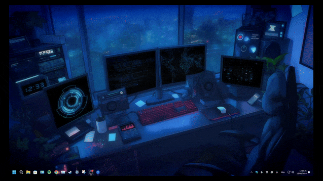

  

<h1 align="center">Saiyid O. Gilani</h1>
<h3 align="center">builder of useful software • full-stack + AI/ML • systems thinker</h3>

  I like turning ambitious ideas into polished, usable products.

---
## About Me

CS and Electrical Engineering student at Drexel University, driven by a constant need to build things that actually matter and understand them at a level deeper than surface.
I thrive under pressure, most recently placing 1st overall at HackPrinceton Spring 2026, Healthcare Track. Hackathons aren't hobby events to me; they're the closest thing to a real proving ground where execution is the only currency. My work spans healthcare data systems, low-level simulations, and everything in between, always with the same underlying question: what does it mean to build something you can actually trust? I care about reliability and clarity far more than complexity, and I'm skeptical of any system, AI or otherwise, that can't explain itself. Philosophy runs alongside the technical work, not separate from it. Tesla put it well: "The present is theirs; the future, for which I really worked, is mine." That's roughly how I think about the problems I choose and the standards I hold myself to. Outside of building, I'm competing, reading, thinking, and trying to understand the world a little more precisely than I did yesterday.

---

## What I Build

- AI tools for messy real-world workflows
- Full-stack products with clean UX and strong product feel
- Research prototypes that can grow into real products
- Systems that automate repetitive work without unnecessary complexity
- Demos that are technically strong and easy to explain

---

## Featured Projects

### NGSP (Princeton Hackathon Overall Best Hack
Privacy-preserving mediation layer for clinical trial workflows using local models, Safe Harbor stripping, routing, and differential privacy.

**Goal:** Make LLM use safer in high-stakes clinical workflows  
**Focus:** Privacy, utility, and product usability  
**Stack:** Python, local model routing, experiments, paper, demo  

[

### 
Standalone project website built and deployed for hackathon presentation, product storytelling, and clean demo flow.

**Goal:** Create a clean, fast, standalone presentation site  
**Focus:** Polished storytelling and simple deployment  
**Stack:** HTML, CSS, JavaScript, Vercel  

### Your Third Best Project
Add one more project here that shows another side of your skill set.

**Goal:** Replace this with your real project summary  
**Focus:** What makes it interesting or useful  
**Stack:** List the main technologies used  

---

## Current Focus

- Building stronger hackathon demos
- Building end-to-end products with better polish
- Building software with real workflow value
- Learning deeper backend systems
- Learning practical ML/AI integration
- Improving architecture, UI presentation, and iteration speed

---

## Tech Stack

## Languages

       
  
  
  
  
  
  
  

 

## Frontend / Product

     
  
  
  
  
  
  
  

## Backend / Infrastructure

      
  
  
  
  
  
  
  
  
   

## AI / Data

       
  
  
  
  
  
  
   

## Currently Exploring

     
  
  
  
  
  
  
   

---

## GitHub Stats

  

  
  

  
  

---

## Connect

   
 
  
  
  

Build fast.
Refine hard.
Keep it useful.
Make it feel intentional.
